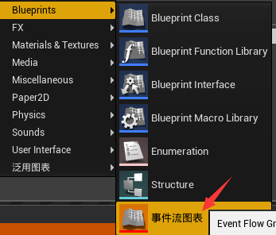

# 事件流编辑器

## 介绍

### 针对的问题

解决了以下问题，可理解为任务系统。

1. 游戏性事件的驱动配置方式
2. 存档
3. 网络同步
4. 脚本逻辑拓展
5. UI界面显示

### 设计思路

将游戏性事件抽象为三个部分

1. EventFlow 一个游戏事件的合集，包含各个事件的驱动和分支
2. EventFlowSequence 游戏事件元素的容器，负责事件的完成确认和分支调度
3. EventFlowElement 游戏性事件的元素，可理解为单独的任务目标（找到某个道具、到达某处、伤害某个对象等等）。负责具体游戏业务逻辑的编写，游戏性数据的记录。

### 编辑器界面介绍

#### 创建方式

#### 主面板

1. 事件流图表，右键序列可添加元素，右键图表则是添加序列
2. 细节面板，下面详细介绍
3. 编译报错面板，编辑器可设置更详细的报错，比如说参数设置为空的报错
4. 在事件流编辑器和蓝图编辑器切换的区域

#### 细节面板

1. 该实例的命名
2. 标记该元素是否在蓝图中持有引用，持有引用的情况下可绑定事件
3. 属性的事件绑定，类似于UMG的操作
4. 事件的绑定

### 如何拓展

#### EventFlowElement

继承EventFlowElement拓展虚函数，绑定游戏对象的多播委托实现游戏对象的事件观测与记录。

1. WhenActivateEventFlowElement 当该事件元素被激活时调用，用于向观测的游戏性对象绑定委托实现记录，调用FinishEventFlowElement表示该元素已完成，调用SetUnfinished将完成的元素重新置为未完成状态。
2. WhenDeactiveEventFlowElement 当元素反激活时调用（整个序列完成时），用于解绑定观测的游戏性对象的委托。
3. GetDescribe 获得该事件元素的描述
4. GetCompileMessage 获得编译时的报错信息，例如不允许空值

### EventFlowSequence

EventFlowElement的容器基类，可与游戏业务逻辑无关，现在已实现顺序型（所有元素完成就向下一个序列移动）和分支型（完成必要元素后根据完成的分支选择下一序列）两种。

### EventFlow

EventFlowSequence的容器基类，创建的新的EventFlow都是其子类，负责每个EventFlowSequence与EventFlowElement实例的事件拓展。

## TODO

1. UXD_EventFlowBase::OnRep_CurrentEventFlowSequenceList重直接使用了BindDynamicDelegates，粒度太粗有性能浪费。
2. 调试可中断游戏。
3. 界面显示再好看些。